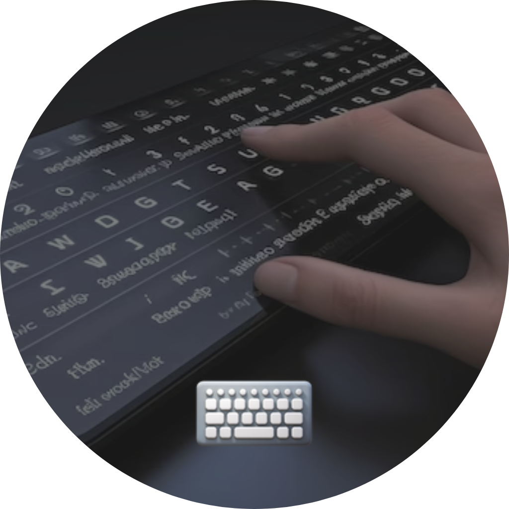
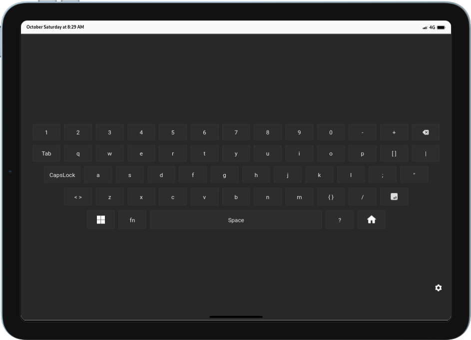

# Teclado Responsivo (v1.0)



Este repositório no GitHub (<https://github.com/mr-body/keyboard-WIFI/>) é a única fonte oficial do projeto. Não baixe versões de sites aleatórios, mesmo que seu nome contenha `Helena keyboard`.

<br>

## Descrição

Esta aplicação implementa um teclado digital responsivo desenvolvido em React Native. O teclado permite que os usuários interajam com dispositivos móveis de forma intuitiva e prática. O aplicativo é projetado para funcionar em dispositivos Android e iOS, permitindo a comunicação com uma API externa para enviar entradas de teclado.


## Funcionalidades

- **Layouts Personalizáveis**: Permite alternar entre diferentes layouts de teclado, incluindo suporte a caracteres especiais.
- **Caps Lock**: Alterna entre letras maiúsculas e minúsculas.
- **Design Responsivo**: O teclado se adapta a diferentes tamanhos de tela e orientações.
- **Comunicação via API**: Envia entradas de teclado para um servidor remoto.

## Tecnologias Utilizadas

- **React Native**: Framework para construção de aplicativos móveis.
- **Expo**: Ferramenta para desenvolvimento de aplicativos React Native.
- **JavaScript**: Linguagem de programação utilizada no desenvolvimento.
- **React Hooks**: Utilização de hooks para gerenciamento de estado e efeitos colaterais.

## Obtenha o Aplicativo

- [Instalação no Linux](doc/linux.md)
- [Instalação no Windows](doc/windows.md)
- [Instalação no macOS](doc/macos.md)

## Exemplos de Uso

Aqui estão alguns exemplos comuns de como interagir com o teclado:

- Para enviar uma entrada de teclado específica:

    ```javascript
    fetch(`http://${ip}:${port}/api/keyboard/btn`);
    ```

## Licença

    Copyright (C) 2024 Walter Santana

    Licenciado sob a Licença Apache, Versão 2.0 (a "Licença");
    você não pode usar este arquivo exceto em conformidade com a Licença.
    Você pode obter uma cópia da Licença em

        http://www.apache.org/licenses/LICENSE-2.0

    A menos que exigido por lei aplicável ou acordado por escrito, o software
    distribuído sob a Licença é distribuído em uma base "COMO ESTÁ",
    SEM GARANTIAS OU CONDIÇÕES DE QUALQUER TIPO, expressas ou implícitas.
    Veja a Licença para as permissões específicas de governança e
    limitações sob a Licença.
